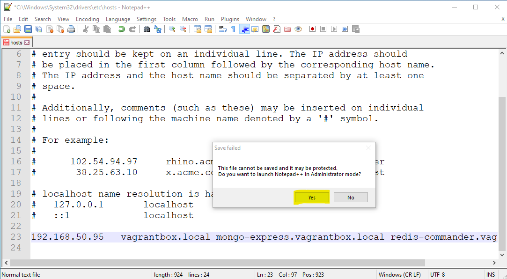

# Esercizio su docker-compose e loro composizione

## Usage
`docker-compose -f docker-compose.yml -f docker-compose-log-infrastructure.yml up`

## Indirizzi dei servizi
Questi sono i link per accedere ai servizi esposti dall'applicazione all'utente finale:
- http://vagrantbox.local/ -> web UI
- http://vagrantbox.local/quotes/ -> quote-service
- http://vagrantbox.local/evaluations/ -> like-service

I componenti ausiliari/aggiuntivi della nostra applicazione sono raggiungibili a questi url:
- http://vagrantbox.local:8080/ -> dashboard di traefik
- http://mongo-express.vagrantbox.local/ -> client web mongodb
- http://redis-commander.vagrantbox.local/ -> client web redis
- http://kibana.vagrantbox.local/ -> monitoring web interface

## Configurare il file `hosts`
In questo esempio _traefik_ è configurato per discriminare le richieste in base al loro il FQDN (il dominio /
sotto-dominio). Per poter collegarsi tramite protocollo HTTP è, di conseguenza, necessario associare gli FQDN utilizzati
con l'indirizzo IP della macchina virtuale gestita tramite vagrant.
Normalmente il servizio DNS associa in automatico a ogni FQDN un indirizzo IP, ma possiamo definire manualmente alcune
associazioni tramite il file _hosts_. Il file _hosts_ esiste in ogni sistema operativo e per essere modificato sono
necessari i permessi di amministratore. Di seguito trovate le istruzioni per modificarlo in Ms Windows 10":
- aprire esplora risorse
- navigare fino alla cartella `C:\Windows\System32\drivers\etc`
  
- aprire il file _hosts_ con l'editor _Notepad++_
- aggiungere la seguente riga `192.168.50.95   vagrantbox.local mongo-express.vagrantbox.local redis-commander.vagrantbox.local swagger-ui.vagrantbox.local kibana.vagrantbox.local`
- "provare" a salvare il file... _Notepad++_ dovrebbe informarci che non è riuscito a salvare il file perché sono
  necessari i permessi di amministratore e ci chiede se vogliamo eseguire l'applicazione in "Administrator mode"
- rispondere "Yes" quando _Notepad++_ ci chiede di eseguire l'applicazione in "Administrator mode"
  
- salvare il file e chiudere _Notepad++_

Se non avete installato _Notepad++_ potreste utilizzare il classico _Notepad_ di Ms Windows, ma esso non possiede la
"Administrator mode", quindi la procedura diventa un po' più macchinosa. Dovreste copiare il file `host` in una cartella
non protetta dal sistema (per es. il vostro desktop), modificare il file e copiare la versione modificata nella cartella
originale `C:\Windows\System32\drivers\etc`.

## Note
Potete trovare la richiesta originale a questo [link](esercizio-compose.md). Essa è scritta in modo poco chiaro, ambiguo e contenente alcuni bias sulla soluzione.
