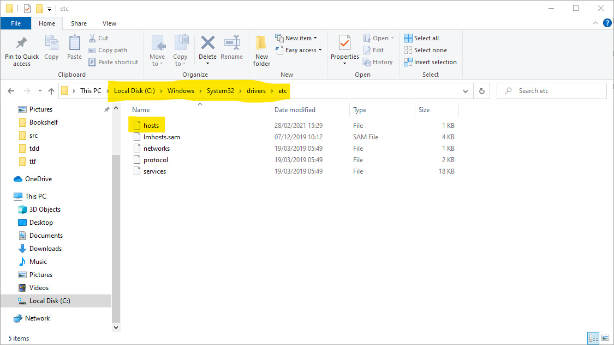

# README

## Descrizione
Questo esempio contiene un docker-compose formato da:
- mongo database server (mongo)
- interfaccia web per mongodb (mongo-express)
- redis database server (redis)
- interfaccia web per redis (redis-commander)
- reverse-proxy / api-gateway realizzato grazie a _traefik_ (traefik)

L'applicazione _traefik_ ci permette di esporre più istanze dello stesso servizio senza incorrere nei problemi di
"binding multiplo delle porte" che normalmente avremmo. Inoltre, ci permette di esporre più servizi utilizzando la
stessa porta e discriminandoli grazie al URL chiamato.

## Configurare il file `hosts`
In questo esempio _traefik_ è configurato per discriminare le richieste in base al loro il FQDN (il dominio /
sotto-dominio). Per poter collegarsi tramite protocollo HTTP è, di conseguenza, necessario associare gli FQDN utilizzati
con l'indirizzo IP della macchina virtuale gestita tramite vagrant.
Normalmente il servizio DNS associa in automatico a ogni FQDN un indirizzo IP, ma possiamo definire manualmente alcune
associazioni tramite il file _hosts_. Il file _hosts_ esiste in ogni sistema operativo e per essere modificato sono
necessari i permessi di amministratore. Di seguito trovate le istruzioni per modificarlo in Ms Windows 10":
- aprire esplora risorse
- navigare fino alla cartella `C:\Windows\System32\drivers\etc`
  
- aprire il file _hosts_ con l'editor _Notepad++_
- aggiungere la seguente riga `192.168.50.95   vagrantbox.local mongo-express.vagrantbox.local redis-commander.vagrantbox.local`
- "provare" a salvare il file... _Notepad++_ dovrebbe informarci che non è riuscito a salvare il file perché sono
necessari i permessi di amministratore e ci chiede se vogliamo eseguire l'applicazione in "Administrator mode"
- rispondere "Yes" quando _Notepad++_ ci chiede di eseguire l'applicazione in "Administrator mode"
  
- salvare il file e chiudere _Notepad++_

Se non avete installato _Notepad++_ potreste utilizzare il classico _Notepad_ di Ms Windows, ma esso non possiede la
"Administrator mode", quindi la procedura diventa un po' più macchinosa. Dovreste copiare il file `host` in una cartella
non protetta dal sistema (per es. il vostro desktop), modificare il file e copiare la versione modificata nella cartella
originale `C:\Windows\System32\drivers\etc`.

## Accedere alle applicazioni
La dashboard del servizio _traefik_ è visualizzabile al seguente url: [http://vagrantbox.local:8080](http://vagrantbox.local:8080)

Le altre applicazioni sono raggiungibili sulla porta HTTP standard (80) e lascio a voi trovare i link per accedere a:
- mongo-express
- redis-commander

## Possibili esperimenti / prove
Sono possibili provare e sperimentare sia con la gestione delle dipendenze che con lo scaling delle applicazioni. Di
seguito riporto alcuni comandi utili per le vostre prove:
- fermare un servizio `docker-compose stop <nome_servizio>`
- variare il numero di istanze delle applicazioni `docker-compose up -d --scale <nome_servizio>=<numero_istanze>`
- vedere i servizi e le loro istanze `docker-compose ps`

> **NOTE:** _traefik_ si auto-configura tramite docker ed è in grado di capire automaticamente quando avviamo o fermiamo
> i servizi e/o le istanze, ma non è istantaneo! Esso ci mette qualche decina di secondi per accorgersi delle modifiche.
