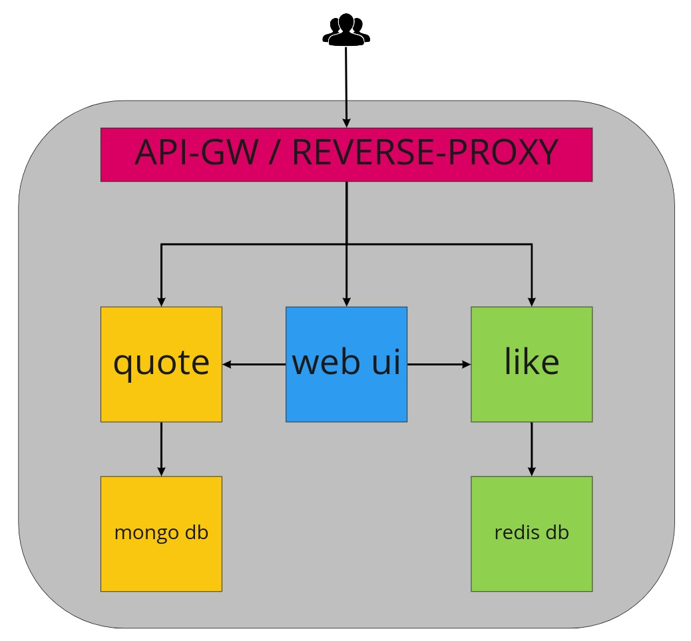
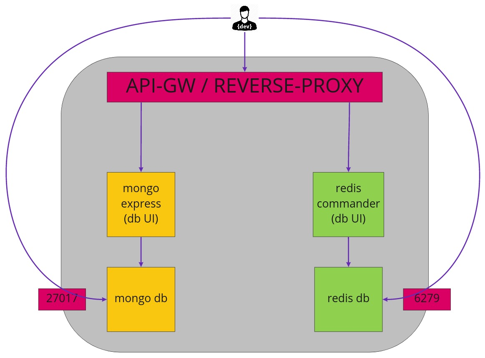
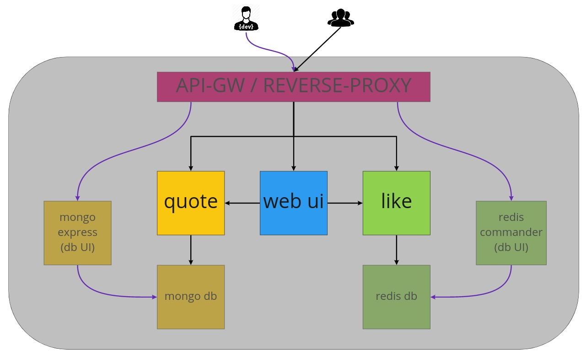

# Esercizio su docker-compose e loro composizione
Quando sviluppiamo software, normalmente, scriviamo codice e avviamo le applicazioni su cui stiamo lavorando direttamente sul nostro computer.
Questo modo di lavorare è molto comodo e ci permette di lavorare in maniera rapida ed efficiente.
Purtroppo, non è sempre possibile adottare questo approccio e quando si sviluppano applicazioni complesse o a micro-servizi diventa quasi impossibile.
L'unica soluzione possibile è quella di sfruttare un server di appoggio su cui sono avviati tutti i componenti che ci permettono di sviluppare localmente un singolo micro-servizio.

## Scenario e casi d'uso
Al fine di sviluppare un'applicazione a micro-servizi sfruttiamo i container docker e l'orchestratore docker-compose per avviare e gestire i vari componenti dell'applicazione stessa.
L'applicazione è un gestore di "citazioni" (quotes in inglese), che ci permette d'inserire tramite UI web le citazioni e di esprimere una valutazione "mi piace" oppure "non mi piace".
L'architettura utilizzata è a micro-servizi e sono identificati i seguenti componenti:
- quote-service
- like-service
- web-ui
- mongo (database usato da quote-service)
- redis (database usato da like-service)

Al fine di questo esercizio relativo ai file docker-compose, identifichiamo i seguenti tre casi d'uso:
- sviluppo locale
- test / dev server
- produzione

### Sviluppo locale
Per lavorare in locale allo sviluppo dei micro-servizi che compongono il backend è necessario:
- mongo accessibile esternamente sulla porta 27017
- redis accessibile esternamente sulla porta 6379
- mongo-express (db ui) accessibile via web
- redis-commander (db ui) accessibile via web
- reverse-proxy per esporre le db ui

Sotto lo schema dei servizi necessari e le interazioni interne ed esterne:

### Test / dev server
Per lavorare in locale allo sviluppo del frontend e per verificare le integrazioni tra i micro-servizi è necessario:
- quote-service accessibile via web
- like-service accessibile via web
- web-ui accessibile via web -- non è necessaria, ma potremmo inserirla per completezza
- mongo
- redis
- mongo-express (db ui) accessibile via web
- redis-commander (db ui) accessibile via web
- reverse-proxy per esporre le db ui

Sotto lo schema dei servizi necessari e le interazioni interne ed esterne:

### Produzione
L'applicazione installata in produzione deve contenere solamente i componenti necessari al proprio funzionamento e devono essere chiuse tutte le porte non necessarie all'utente finale.

## Richiesta
Creare i docker-file necessari ai tre casi d'uso elencati sopra. Per ogni caso d'uso possono essere utilizzati uno o più docker-file ed essi possono essere riutilizzati tra i differenti casi d'uso.
Inoltre, è necessario documentare il comando da lanciare per avviare ogni caso d'uso e.g. `docker-compose -f file.yml up`

## Indirizzi dei servizi
Questi sono i link per accedere ai servizi esposti dall'applicazione all'utente finale:
- http://vagrantbox.local/ -> web UI
- http://vagrantbox.local/quotes/ -> quote-service
- http://vagrantbox.local/evaluations/ -> like-service

I componenti ausiliari/aggiuntivi della nostra applicazione sono raggiungibili a questi url:
- http://vagrantbox.local:8080/ -> dashboard di traefik
- http://mongo-express.vagrantbox.local/ -> client web mongodb
- http://redis-commander.vagrantbox.local/ -> client web redis

## Note
Potete trovare la richiesta originale a questo [link](esercizio-compose.md). Essa è scritta in modo poco chiaro, ambiguo e contenente alcuni bias sulla soluzione.
